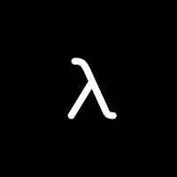

<div align="center">


# Stoream

*Minimalist self-hosted network disk system*

</div>

- Issues: https://github.com/x-fri/stoream/issues
- Contribution: https://github.com/x-fri/stoream/pulls

<center>

| Module | Status                                                                                                                                                                     |
| ------ | -------------------------------------------------------------------------------------------------------------------------------------------------------------------------- |
| WebUI  | [](https://github.com/X-FRI/stoream/actions/workflows/stoream-webui.yaml) |

</center>

## Intro.

This project is mainly constructed using the following technologies:

### WebUI
- <a href="https://rescript-lang.org">  Fast, Simple, Fully Typed JavaScript from the Future </a>
- <a href="https://www.typescriptlang.org/">  TypeScript is JavaScript with syntax for types. </a>
- <a href="https://react.dev/">  The library for web and native user interfaces </a>
- <a href="https://geist-ui.dev/">  An open source design system for building modern websites and applications. </a>

### Engine
- <a href="https://www.rust-lang.org/">  A language empowering everyone to build reliable and efficient software. </a>
- [Axum: Ergonomic and modular web framework built with Tokio, Tower, and Hyper](https://github.com/tokio-rs/axum)

> Communication between WebUI and Engine via WebSocket.

## Docs

### Developer

#### WebUI

For NodeJS, we recommend using [NVM](https://github.com/nvm-sh/nvm) to manage versions (If you already have a NodeJS environment, you can skip this step):

```shell
nvm install 20
```

This project is built using [pnpm](https://pnpm.io/), so:

```shell
npm install -g pnpm
```

Now you can run stoream:

```shell
pnpm dev
```

#### Engine

For Rust, we recommend using [rustup](https://rustup.rs/) to manage its toolchain.

Then use the following command to install the latest stable rust:

```
rustup install stable
```

If you have installed Rust before and want to update to the latest stable version, you can use the following command:

```
rustup update
```

> [!NOTE]
> *OPTIONAL*: In addition, we also use [UPX](https://upx.github.io/) to > optimize the size of the executable file. Most Linux distributions can > be installed through the package manager, such as on openSUSE:
> ```
> zypper in upx
> ```
> then
> ```
> upx --best --lzma target/release/stoream-engine
> ```

## [LICENSE](./LICENSE)

Copyright (c) 2024 The X-Files Research Institute

All rights reserved.

Redistribution and use in source and binary forms, with or without modification,
are permitted provided that the following conditions are met:

    * Redistributions of source code must retain the above copyright notice,
      this list of conditions and the following disclaimer.
    * Redistributions in binary form must reproduce the above copyright notice,
      this list of conditions and the following disclaimer in the documentation
      and/or other materials provided with the distribution.
    * Neither the name of Stoream nor the names of its contributors
      may be used to endorse or promote products derived from this software
      without specific prior written permission.

THIS SOFTWARE IS PROVIDED BY THE COPYRIGHT HOLDERS AND CONTRIBUTORS
"AS IS" AND ANY EXPRESS OR IMPLIED WARRANTIES, INCLUDING, BUT NOT
LIMITED TO, THE IMPLIED WARRANTIES OF MERCHANTABILITY AND FITNESS FOR
A PARTICULAR PURPOSE ARE DISCLAIMED. IN NO EVENT SHALL THE COPYRIGHT OWNER OR
CONTRIBUTORS BE LIABLE FOR ANY DIRECT, INDIRECT, INCIDENTAL, SPECIAL,
EXEMPLARY, OR CONSEQUENTIAL DAMAGES (INCLUDING, BUT NOT LIMITED TO,
PROCUREMENT OF SUBSTITUTE GOODS OR SERVICES; LOSS OF USE, DATA, OR
PROFITS; OR BUSINESS INTERRUPTION) HOWEVER CAUSED AND ON ANY THEORY OF
LIABILITY, WHETHER IN CONTRACT, STRICT LIABILITY, OR TORT (INCLUDING
NEGLIGENCE OR OTHERWISE) ARISING IN ANY WAY OUT OF THE USE OF THIS
SOFTWARE, EVEN IF ADVISED OF THE POSSIBILITY OF SUCH DAMAGE.
